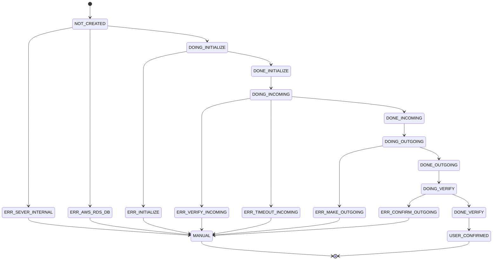

# Doc for status tree

- Names in this file is not very nicely defined. May need some discussion.
- Also mermaid seems not capable of rendering this diagram with a clear style.

```mermaid
  stateDiagram
    [*] --> NOT_CREATED
    NOT_CREATED --> ERR_SEVER_INTERNAL
    NOT_CREATED --> ERR_AWS_RDS_DB
    NOT_CREATED --> DOING_INITIALIZE
    DOING_INITIALIZE --> ERR_INITIALIZE
    DOING_INITIALIZE --> DONE_INITIALIZE
    DONE_INITIALIZE --> DOING_INCOMING
    DOING_INCOMING --> ERR_VERIFY_INCOMING
    DOING_INCOMING --> ERR_TIMEOUT_INCOMING
    DOING_INCOMING --> DONE_INCOMING
    DONE_INCOMING --> DOING_OUTGOING
    DOING_OUTGOING --> ERR_MAKE_OUTGOING
    DOING_OUTGOING --> DONE_OUTGOING
    DONE_OUTGOING --> DOING_VERIFY
    DOING_VERIFY --> ERR_CONFIRM_OUTGOING
    DOING_VERIFY --> DONE_VERIFY
    DONE_VERIFY --> USER_CONFIRMED
    USER_CONFIRMED --> [*]
    ERR_SEVER_INTERNAL --> MANUAL
    ERR_AWS_RDS_DB --> MANUAL
    ERR_INITIALIZE --> MANUAL
    ERR_VERIFY_INCOMING --> MANUAL
    ERR_TIMEOUT_INCOMING --> MANUAL
    ERR_MAKE_OUTGOING --> MANUAL
    ERR_CONFIRM_OUTGOING --> MANUAL
    MANUAL --> [*]
```
